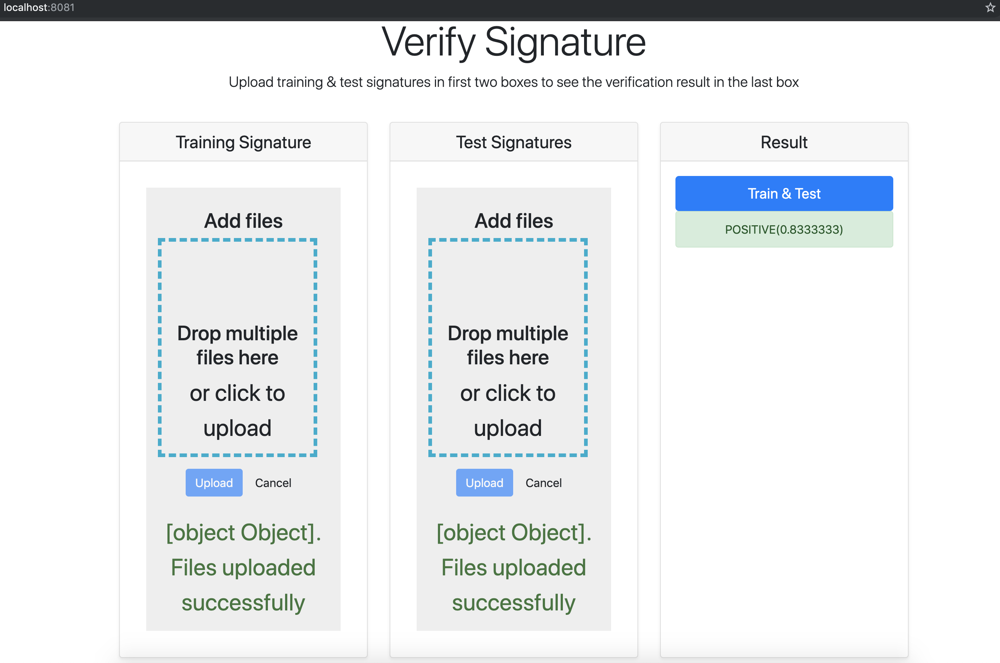

## Developing a Signature verifier application with Tensorflow, OpenCV, Flask and Vue.js

### Want to learn how to build this?

#### Want to use this project?

1. Fork/Clone

1. Run the server-side Flask app in one terminal window:

    *Linux*
    ```sh
    $ cd server
    $ python3.7 -m venv env
    $ source env/bin/activate
    (env)$ pip install -r requirements.txt
    (env)$ python app.py
    ```
     *Windows*
    ```sh
    $ cd server
    $ python -m venv env
    $ env\Scripts\activate.bat
    (env)$ pip install -r requirements.txt
    (env)$ python app.py
    ```

    Navigate to [http://localhost:5000](http://localhost:5000)

1. Run the client-side Vue app in a different terminal window:

    ```sh
    $ cd client
    $ npm install
    $ npm run serve
    ```

    Navigate to [http://localhost:8080](http://localhost:8080)
    
### Screenshot


